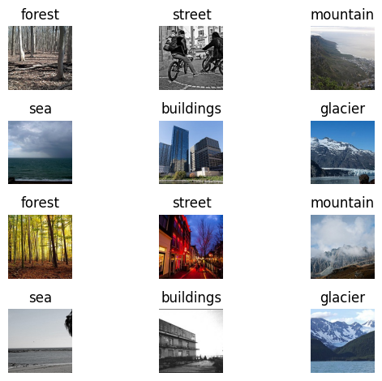

# Intel Image Classification

## Overview
This project aims to classify images into different classes using a deep learning model. The dataset consists of images related to various classes from the Intel Image classification dataset.

## Dataset
The dataset contains images from the following classes:
1. Forest
2. Street
3. Mountain
4. Sea
5. Building
6. Glacier



## Model Accuracy
The trained model achieved an accuracy of 87.4% on the validation dataset.


## Prediction Example
Here is an example of how the model predicts the class of an image:


## Installation
1. Clone the repository.
2. Install the required dependencies by running the following command:
    ```
    pip install -r requirements.txt
    ```

## Usage
To use this project, follow these steps:

1. Launch Jupyter Notebook by running the following command:
    ```
    jupyter notebook
    ```
2. Open the `solution.ipynb` notebook in Jupyter Notebook.
3. Follow the instructions in the notebook to classify images using the trained model.

Note: Make sure you have the necessary hardware and software requirements to run Jupyter Notebook.

## Contributing
Contributions are welcome! If you find any issues or have suggestions for improvement, please open an issue or submit a pull request.

## License
This project is licensed under the [MIT License](LICENSE).